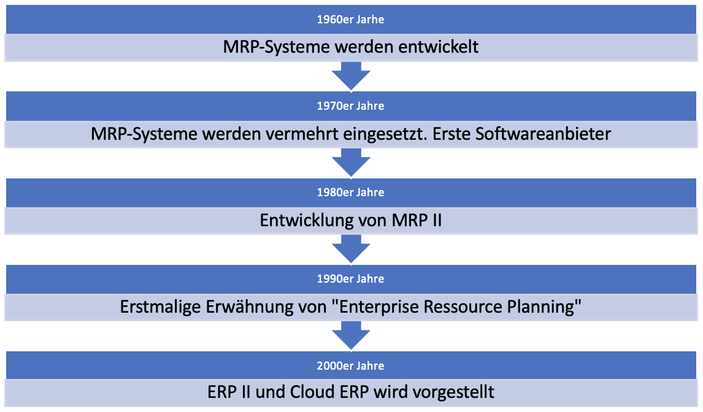
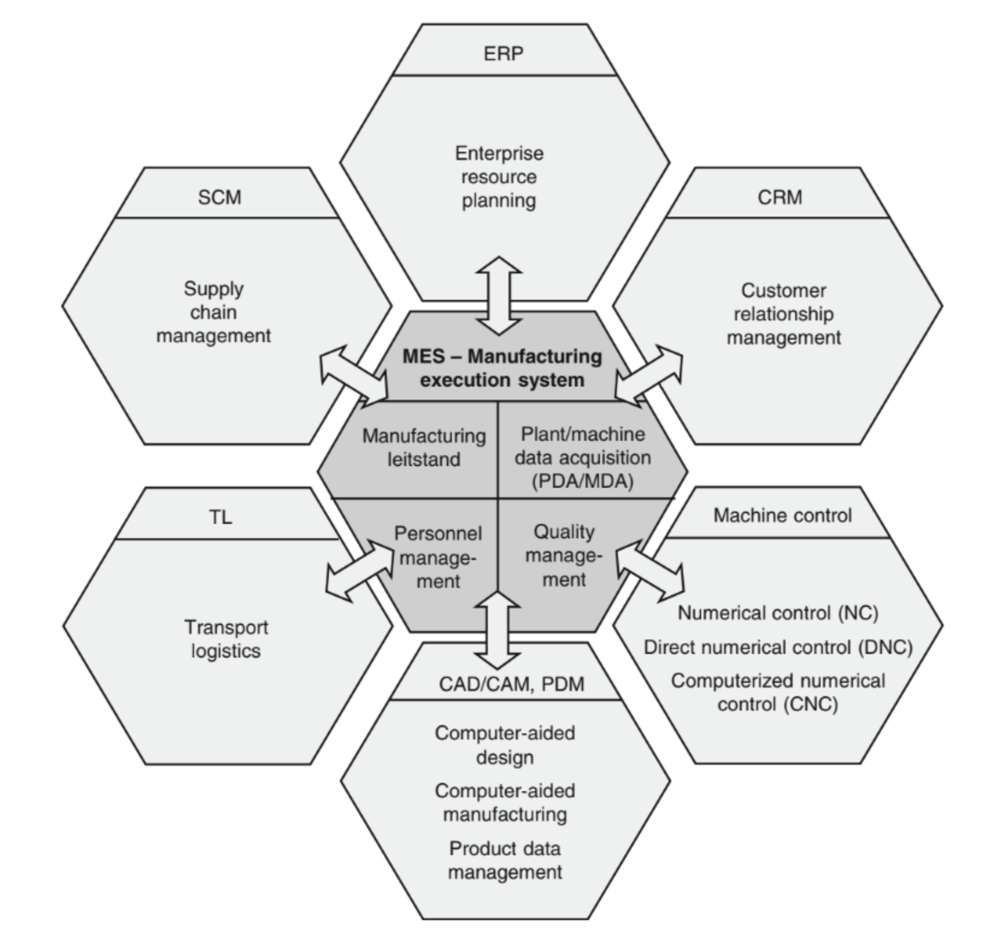
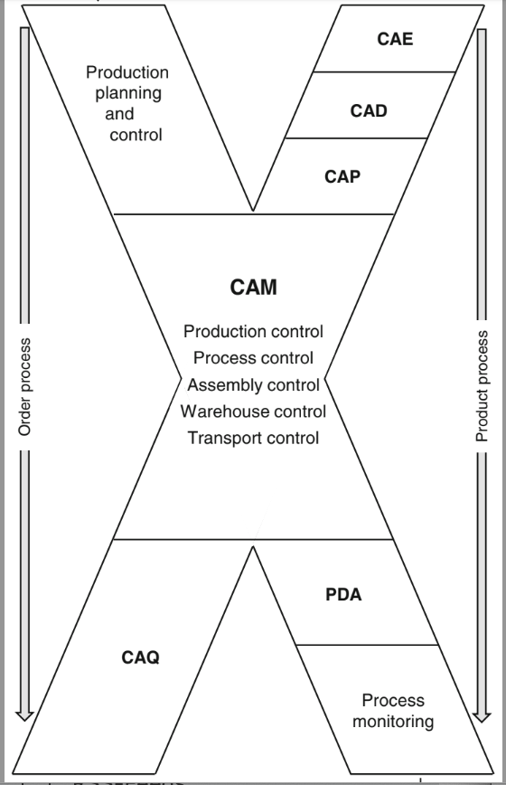

# **Betriebliche Informationssysteme**
Autoren: Clemens Neuwirth, Moritz Binder, Martin Haas

##### **Inhaltsverzeichnis**
1. Geschichte Industrielle Informationssysteme
2. ERP - Enterprise Ressource Planning
3. CAx – Computer-Aided x
4. PLM – Product Lifecycle Management/ Produktlebenszyklusmanagement
5. BPM – Business Process Management
6. BI – Business Intelligence
7. Quellen

## **Geschichte Industrielle Informationssysteme**
Industrielle Informationssysteme sind Systeme, die Prozesse von Unternehmen abbilden, mit dem Ziel Wert zu schaffen, Kosten zu senken und im Generellen die Effizienz zu steigern. Um dieses Ziel zu erreichen, werden die richtigen Informationen, zur richtigen Zeit, den richtigen Personen zur Verfügung gestellt um bei Entscheidungsfindung und Planung der Prozesse zu unterstützen. Solch Industrielle Informationssysteme umfassen eine große Palette an Funktionen wie zum Beispiel:
* Erstellung von Rechnung
* Verfolgung von Waren
* Aufzeichnung von Arbeitszeiten
* Erstellen von Fertigungsaufträgen

Die Geschichte von Industriellen Informationssystemen hat schon vor circa 60 Jahren begonnen. Seitdem hat es mehrere verschiedene Varianten und Namen dafür gegeben.

### **MRP**
In den 1960er Jahren hat J.I. Case, welcher Hersteller von Maschinen war, mit IBM an der Entwicklung einer computer-basierten Anwendung zur Unterstützung des betrieblichen Einkaufs und der Produktionsplanung gearbeitet. Diese Art von System wurde infolgedessen als MRP (Material-Requirement-Planning) bekannt und wurde von weiteren großen Herstellern nachgestellt beziehungsweise selbst entwickelt.
In den 1970er Jahren schritt die Implementierung von solchen Systemen schnell voran, jedoch konnten sich die Entwicklung und das Know-How dafür nur große Unternehmen leisten, welche über das entsprechende Budget verfügten. Schlussendlich stiegen mehrere Softwareanbieter, wie zum Beispiel Oracle und JD Edwards, in diesen Markt ein und machten MRP-Systeme für alle Unternehmen zugänglich.

### **MRP II**
Durch den verbreiteten Einsatz von MRP wurde in den 1980er Jahren nach und nach erkannt, dass die Informationen, welche durch das MRP erzeugt werden, weiterverwendet werden können. Dies hatte diverse Erweiterungen, zum Beispiel im Bereich der Kapazitätsplanung und der Personalplanung zu Folge. Das MRP-System hat sich von einem Materialbedarfsplannungssystem zu einem Steuerungs- und Planungssystem entwickelt, was in weitere Folge als MRP II (Manufacturing Requirement Planning II) bekannt wurde.

### **ERP**
Durch neue Technologien im IT Bereich zu Beginn der 1980er Jahre, wie zum Beispiel lokale Netzwerke und objektorientierte Programmierung, wurde große Fortschritte im Bereich der Industriellen Informationssysteme erzielt und MRP II immer weiter entwickelt. Dies führte dazu, dass im Jahre 1990 das Marktforschungsunternehmen Gartner den Begriff „Enterprise Ressource Planning“ zum ersten Mal erwähnte. Dabei wurden ERP Systeme wie sie heutzutage zum Einsatz kommen beschrieben.

### **Cloud ERP**
Damals wie heute ist der Einsatz von Cloud-ERP-Systemen ein interessanter Anwendungsfall. 1998 wurde erstmals von NetSuite ein solches System angeboten. Vorteile davon waren Zugriff von jedem Gerät mit Internetanschluss und Abbau von IT-Ressourcen. Cloud-Modelle können individuell an Unternehmen angepasst werden, weshalb diese Lösungen auch für kleinere Unternehmen interessant wurden.

### **ERP II**
Das Marktforschungsunternehmen Gartner führte im Jahre 2000 den Begriff ERP II ein, welches internetfähige ERP Systeme bezeichnet die Daten aus verschiedenen Systemen miteinbeziehen können. Dies umfasst unter anderem folgende Systeme:
* Customer Relationship Management (CRM)
* Supply Chain Management (SCM
* Product Lifecycle Management (PLM)
* Business Intelligence (BI)
* Business Process Management (BPM)

## **ERP - Enterprise Ressource Planning**
Enterprise Ressource Planning beschreibt die Steuerung von Ressourcen, wie Vermögen, Personal und Betriebsmittel in einem Unternehmen. Dabei ist das Ziel eine Optimierung der Geschäftsprozesse und die miteinhergehende Verbesserung der betrieblichen und organisatorischen Strukturen. Durch die enorm große Anzahl an Einflussfaktoren und daraus resultierende Daten, muss man zur Steuerung und Planung des Unternehmens auf computergestützte ERP-Systeme zurückgreifen.

### **ERP-System**
Ein ERP-System ist eine Softwarelösung, welche als Ziel die optimale Ressourcen-Planung verfolgt. Dabei soll das gesamte Unternehmen und dessen Prozesse abgebildet werden, um ein Gesamtbild über vorhandene Prozesse und Ressourcen zu erhalten. Durch die Verknüpfung der Prozesse wird ein durchgängiger Datenfluss ermöglicht und die Datenintegrität durch Nutzung von gemeinsamen Unternehmensdaten forciert.

### **ERP Module**
Ein ERP System sollte, wie zuvor schon beschrieben, idealerweise die gesamten Unternehmensprozesse abbilden. Dabei können diese in spezifische Bereiche, auch Module genannt, unterteilt werden. Die häufigsten verwendeten ERP-Module werden folgend aufgelistet:

* Finanzen & Controlling: Automatisierung von Finanzaufgaben und Unterstützung bei der Buchhaltung. Erstellung von Finanzberichten.
* Personalverwaltung: Automatisierung von Gehaltsabrechnung und Unterstützung bei Berechnung der Arbeitszeiten und Arbeitszeiterfassung.
* Einkauf & Beschaffung: Bezug von Dienstleistungen und Materialien zur Erfüllung der Geschäftsprozesse. Automatisierung von Angebotsstellung, Vertragserstellung und Abschluss.
* Logistik: Verfolgung von Warenbewegungen. Automatisierte Bestandverwaltung, Lagerhaltung und Transport.

### **Nutzen eines ERP-Systems**
Mit individuell angepassten ERP Systemen kann in den verschiedenen Unternehmensbereichen großer Nutzen generiert werden:
* Konsistente Daten: Durch Zusammenführung aller Daten in einem System, ist Inkonsistenz oder Doppelerfassung nicht möglich. Dies vermindert wiederum manuelle Datenpflege und Datenbankfehler und etabliert eine einheitliche Datenbasis.
* Standardisierung von Geschäftsprozessen: Mittels ERP-Systems werden Unternehmensabläufe standardisiert und in weitere Folge optimiert. Dies hat effizienteres Wirtschaften zu Folge.
* Flexiblere Prozessgestaltung: Durch Zugriff auf verschiedenste Daten, lassen sich kurzfristig Änderungen am Prozess zur Optimierung, wie zum Beispiel Steigerung der Produktivität, durchführen.
* Ganzheitliche Betrachtung der Unternehmensdaten: Durch „Echtzeit“ Zugriff auf etwaig Daten aus dem Unternehmen lassen sich jederzeit fundierte Entscheidungen treffen.

### **Vorteile eines ERP Systems**
* Steigerung der Produktivität: Automatisierung und Optimierung von Geschäftsprozessen für Kostenersparnisse
* Erhöhung der Datenqualität: Inkosistenzen und Informationssilos werden vermieden.
* Optimierung des Informationsflusses: Infomationen sind immer und überall verfügbar. Erleichtert Zusammenarbeit über Abteilungs- und Unternehmensgrenzen.
* Hohe Flexibilität: Durch Zugriff auf Echtzeitdaten lassen sich Chancen & Risiken schneller erkennen und ein Nutzen kann daraus gezogen werden.

### **Nachteile eines ERP Systems**
* Hohe Investitionskosten: Die Einführung eines ERP Systems ist mit erheblichen Kosten verbunden.
* Abhängigkeit von ERP-Software Hersteller: Bei Wartungen oder Updates beziehungsweise bei Fehler der Software ist man auf den Hersteller angewiesen.
* Änderung von etablierten Geschäftsprozessen: Um alle Prozesse im ERP-System abbilden zu können, ist es manchmal nötig Prozesse zu Ändern oder anzupassen.

## **MES – Manufacturing Execution System**
Ein MES ist ein Informationssystem auf Shop-Floor-Ebene. In ihm werden alle Informationen der Shop-Floor-Ebene zusammengefasst. Es bietet einen Überblick über die Prozesse, die dort stattfinden und fasst alle daraus in Echtzeit generierten Daten gut ersichtlich zusammen. Es wird für die Auftragsbearbeitung, Bestandsführung und Ressourcenüberwachung verwendet. Das MES erweitert das ERP-System und unterstützt die Produktion in der Kurzzeitplanung. Dies ist notwendig, da MRP II und auch ERP eher auf gröbere Planung und einen größeren Planungshorizont ausgelegt ist. Im Gegensatz dazu geht man beim MES ins Detail und bricht die grobe Planung so weit herunter, dass nun konkret nach einem Plan gefertigt werden kann. Weiters kann man über das MES Produktionsprozesse und Produkte einfach nachverfolgen und analysieren. Daraus kann man dann Kennzahlen gewinnen, wie zum Beispiel den Key-Performance-Indicator.

Über die Benutzeroberfläche des MES kann man alle Daten einfach einsehen und bekommt dadurch gleich vor Ort einen Überblick davon, wie vorangegangene Daten aussahen und kann diese mit den aktuellen abgleichen und überprüfen, ob die Werte passen und bei Abweichungen, aufgrund der Echtzeiterfassung, gleich reagieren.

Des weiteren fungiert das MES als Bindeglied zwischen den unterschiedlichen Informationssystemen wie ERP und SCADA und tauscht mit diesen Informationen aus. Es liefert dem Top-Floor wichtige Daten aus dem Shop-Floor. Dadurch kann man auf konkrete Probleme in der Fertigung aufmerksam werden und darauf basierend Maßnahmen ableiten, um die Produktion effizienter zu gestalten. Es sitzt außerdem als Bindeglied zwischen Logistik-, PLM- und Kontrollsystemen. Dadurch wird eine Verknüpfung erschaffen und Informationen können einfach und schnell von einer Station zur nächsten fließen. Außerdem enthält es Informationen dazu, welche MitarbeiterInnen wann, an welcher Maschine arbeiten.

Der Aufbau eines MES sieht wie folgt aus:

Den Kern des Manufacturing Execution Systems bilden der Manufacturing Leitstand, die Maschinendatensammlung (PDA/MDA), das Personalmanagement und das Qualitätsmanagement.

Die Umgebung dieses Kerns bilden Customer Relations Management (CRM), Machine Control, CAD/CAM, Transport Logistics (TL), Supply Chain Management (SCL) und das ERP. Durch diese Abbildung kann man die Rolle des MES als Bindeglied zwischen den Informationssystemen gut erkennen.

Ein besonders wichtiges Element des MES ist das Capacity-Scheduling. Aufgrund der generierten Daten werden Aufträge nach Priorität geordnet und an Maschinen gegeben, die freie Kapazitäten haben, um Engpässe zu vermeiden.

Der wichtigste Teil, das Leitstandsystem, ist verantwortlich für die Überwachung und Kontrolle des Shop-Floors und das Melden an andere Stationen im Betrieb. Dies gibt es auch als Einzelsystem, wurde jedoch vom MES überholt.

Der große Vorteil eines Manufacturing Execution Systems ist die Kombination der Kerngebiete in einem System. Dadurch können Engpässe und Probleme früher erkannt werden, die Durchlaufzeit und die Auslastung werden verbessert. Infolgedessen steigt die Planungsqualität und Liefertermine können besser eingehalten werden.
 
## **CAx – Computer-Aided x**

Dieser Begriff steht für computergesteuerte Fertigungstechniken, wie zum Beispiel CAD, CAE oder CAP. CAx-Systeme wurden auch unter dem Begriff „Computer Integrated Manufacturing“ (CIM) zusammengefasst. Bei CIM ist das Ziel computergestützte Systeme in alle Prozesse zu integrieren. Da meist jedoch nur einzelne CA-Komponenten in einem Unternehmen eingesetzt werden, wurde der Begriff CIM eher in den Hintergrund gedrängt. Im Folgenden werden nun einige CAx-Systeme beschrieben.
 
#### **CAD Computer-Aided Design:**
Dieses System hilft beim Entwerfen von Produkten. Über ein CAD-Programm kann ein virtuelles Modell erstellt oder verändert werden. Werden einzelne Maße im Design verändert, kann das Programm das komplette Modell oder Teile davon automatisch an die neuen Parameter anpassen. Bei einem 3D-CAD-Programm am PC kann man sich dieses dann aus allen Perspektiven genau ansehen, bevor man es tatsächlich fertigen lässt. Bei 2D-Modellierungen fertigt man nur Skizzen an, die in nur einer Ebene liegen und kann diese als technische Zeichnungen verwenden. Der Vorteil eines 3D-CADs ist, dass man sich von der virtuellen 3D-Konstruktion automatisch eine technische Zeichnung erstellen lassen kann. Außerdem können die CAD-Files direkt an eine Maschine, wie zum Beispiel einen 3D-Drucker, gesendet werden, welche dieses dann verarbeitet. Des Weiteren besitzt CAD eine Schnittstelle zum ERP-System. Durch die Pläne kann dort dann beispielsweise eine Materialliste angelegt werden.
Ferner gibt es das System ECAD. Mit dieser Methode lassen sich elektrische Schaltkreise designen.
 
#### **CAM – Computer-Aided Manufacturing:**
Im CAM laufen technische und geschäftliche Informationen zusammen. Es ist zuständig für die Überwachung von technischen Fertigungsabläufen. Außerdem ist es verantwortlich für ausführende Tätigkeiten in der Produktion. Aufgrund der unterschiedlichen Auslegungen, ob CAM Geschäftsaufgaben und technische Ausführung oder nur die technische Ausführung beinhaltet, gibt es jedoch keine eindeutige Definition für CAM.

 In der obigen Abbildung ist zu sehen, wie die technischen und die geschäftlichen Abläufe bei CAM zusammenlaufen. Von links oben nach rechts unten verläuft der Geschäftsprozess und von rechts oben nach links unten der Produktionsprozess.

In den Bereich von CAM fallen auch NC-Geräte (Numeric Control), wie zum Beispiel CNC-Maschinen. NC-Programme geben der Maschine die Schritte vor, die zu erledigen sind, um ein Produkt zu fertigen. Bei einer CNC Fräse gibt das Programm beispielsweise vor, an welchen Stellen wie viel abgetragen werden muss und die Fräse führt dies dann selbstständig aus.
 
#### **CAE – Computer-Aided Engineering:**
Dieser Begriff bezeichnet alle Systeme, die den Entwicklungsprozess eines Produktes mit einem Computer unterstützt und ist somit gewissermaßen mit CAD verwandt.

Abschließend kann man sagen, dass CAx-Systeme eine erhebliche Erleichterung von Fertigungs- und Planungsprozessen bringen. Sei es durch die automatische Erzeugung von technischen Zeichnungen, direkte Weitergabe an eine Fertigungsmaschine dieser Pläne oder selbstständige Fertigung mit CNC. Ein weiterer Vorteil von CAx ist die rasche Erkennung von Fehlern. Dies führt dazu, dass die Kosten für die Behebung dieser wesentlich geringer sind. Noch besser ist es natürlich, wenn durch ein solches System Fehler, zum Beispiel menschliche Fehler bei Designprozessen, komplett vermieden werden können.

## **PLM – Product Lifecycle Management/ Produktlebenszyklusmanagement**
Das Produktlebenszyklusmanagement kann als Geschäftsprozess beschrieben werden, in welchem die Produkte eines Unternehmens entlang ihres gesamten Lebenszyklus abgebildet werden. Von der ersten Idee für ein Produkt bis hin zu dessen Entsorgung. 
 

 
 PLM setzt sich aus mehreren verschiedenen Technologien zusammen. Dazu gehören unter vielen anderen:

- **Computer-Aided Design (CAD)**, **Computer-Aided Manufacturng (CAM)**, **Computer-Aided Engineering (CAE)**
- **Product Data Management (PDM)**: enthält Informationen zu Design, Spezifikationen, Produktion und Vertrieb des Produktes
- **Enterprise-Content-Management (ECM)**: umfasst Methoden und Werkzeuge zur Verwaltung, Speicherung, Bewahrung und Bereitstellung von Inhalten und Dokumenten zur Unterstützung organisatorischer Prozesse im Unternehmen
- **Konfigurationsmanagement**: stellt sicher, dass jedes Produkt dieselben physischen und funktionalen Eigenschaften besitzt
- **Sourcing Management**: enthält Informationen zum Lieferanten wie seine Liefertreue, Zertifizierung und den Bestellverlauf
- **Informations- und Kollaborationsmanagement**: Software zur Terminplanung, Kommunikation, Kollaboration, Visualisierung und Dokumentation trägt dazu bei, dass ein global verteiltes Mitarbeiterteam am selben Produkt arbeiten kann und entlang des Produktlebenszyklus Zugang zu synchronisierten Informationen hat
- **Programm- und Projektmanagement**
 
 
### **Nutzen von PLM**
PLM richtig und vor allem sinnvoll anzuwenden hat einige Vorteile fürs Unternehmen, wie beispielsweise:
 
- Reduzierte Forschung- und Entwicklungskosten
- Optimiertes Produktdesign
- Verbesserte Produktqualität
- Reduzieren von Abfall
- Verringert Zeit bis Produkt am Markt ist
Erzielt werden diese Vorteile, da der gesamten Wertschöpfungskette durch PLM der Zugriff auf genauere und übersichtlichere Daten gewährleistet wird.
 
 
### **Vor- und Nachteile von PLM**
**1. Standardisierung**: durch das Erstellen von wiederverwendbaren Design- Entwicklungs- und Herstellungsstandards kann die Qualität eines Produktes gesichert werden. Zusätzlich lassen sich dadurch unter anderem der Service Level und die Durchlaufzeit verbessern und die Lagerbestände reduzieren.

**2. Kundenservice**: öffentlich zugängliche Produktinformationen erleichtern es dem Kunden, eine Kaufentscheidung zu treffen.

**3. Weltweite Zusammenarbeit**: indem essenzielle Produktinformation der gesamten Wertschöpfungskette bereitgestellt wird, ist es Beteiligten auf der ganzen Welt möglich, an einem Produkt zu arbeiten. Dadurch wird schnellere Entwicklung und Verbesserung des Produktes ermöglicht.

## **BPM – Business Process Management**
Business Process Management beschäftigt sich mit zwei sehr wichtigen Themen für jedes Unternehmen:

**1. Zukunftsstrategie**: Finanzieller Erfolg unter Berücksichtigung aktueller und erwarteter Kunden und deren Bedürfnisse. Durch Analyse und Verständnis von Marktkonkurrenten, Einhaltung legaler und behördlicher Rahmenbedingungen und umweltbedingten Einschränkungen soll der Einkommensstrom gesichert und der Marktwert erhöht werden.

**2. Unternehmensstrategie**: Durch interne Faktoren wie Prozessmanagement, Geschäftssysteme, Mitarbeiterkompetenzen, -training und -schulungen sollen die Zukunftsziele des Unternehmens erreicht werden.
 
BPM umfasst sämtliche Tätigkeiten eines Unternehmens, welche zum Design, zur Modellierung, Exekution, Überwachung und Optimierung eines Geschäftsprozesses beitragen. Dabei werden Computerbasierte Lösungen zur Hilfe gezogen. Diese unterstützen das Unternehmen bei der Visualisierung und Analyse ihrer Prozesse, liefern Verbesserungsvorschläge und helfen letztendlich bei der Entscheidungstreffung.
 
### **Der BPM-Kreislauf**
Um das Unternehmen an den sich ständig ändernden Markt anzupassen, ist es notwendig, die Unternehmensprozesse kontinuierlich zu überarbeiten und zu optimieren. Dazu tragen 8 wesentliche Schritte bei:

**1. Strategische Planung**: der sich ständig ändernde Markt zwingt Unternehmen dazu, dauerhafte Änderungen an Prozessen durchzuführen, um die Bedürfnisse der Kunden zu erfüllen.

**2. Identifizierung des Prozesses**: ein Prozess kann wie folgt definiert werden: eine Reihe aus Ressourcen und Aktivitäten, welche benötigt werden, um aus beliebigen Inputs beliebige Outputs zu erzeugen.

**3. Wahl des Prozesses**: bei der Wahl des Unternehmensprozesses sind verschiedenste Kriterien zu beachten. Dazu zählen unter anderem die Durchschaubarkeit, das Potenzial für Verbesserungen und den Einfluss auf den Umsatz des Unternehmens.

**4. Prozess visualisieren**: Ab hier beginnt der Kreislauf. Eine Prozesslandkarte zerlegt den gesamten Prozess in Teilprozesse wie Leistungsprozesse, Führungsprozesse und Unterstützungsprozesse. Innerhalb dieser Abschnitte kann nochmals zwischen wertbringenden und wertlosen Prozessen unterschieden werden.

**5. Verbesserungspotenzial finden**: mit dem Ziel, so viel Geld wie möglich einzusparen liegt es im Interesse eines Unternehmens alle Prozesse zu Eleminieren, welche nicht direkt zur Wertschöpfung beitragen.

**6. Probleme analysieren**: um ein Problem aus der Welt zu schaffen gilt es erst zu definieren, was ein Problem ist. Danach werden verschiedene Lösungswege gefunden und anschließend evaluiert. Probleme in Unternehmen können grob in drei Kategorien unterteilt werden: *Systemprobleme*, *technische Probleme* und *Personalprobleme*.

**7. Änderungen implementieren**: die besten zuvor gefundenen Lösungsansätze werden umgesetzt und in den neuen Prozess integriert.

**8. Leistung messen**: zuletzt wird die Leistung des verbesserten Prozesses gemessen, um einen Vergleich herstellen zu können.
 
 

 
 
 
## **BI – Business Intelligence**
Business Intelligence umfasst Technologien, Tools und Techniken, die benutzt werden, um aus Daten Information zu generieren, aus dieser Information Wissen zu schaffen und mithilfe dieses Wissens zu handeln. 

 
### **BI Technologien**
#### **Data Warehouse**
Ein Data Warehouse enthält großen Mengen an zeitbasierten Daten. Um diese Vielzahl an Informationen übersichtlich zu halten, werden nur einzelne Attribute der Transaktionsdaten abgespeichert. Diese werden anschließend anhand vordefinierter Standards formatiert, um konsistente Analyse zu gewährleisten. 
 

 
#### **Business Intelligence**
BI zielt darauf hinaus, die Daten aus dem Data Warehouse dynamisch und flexibel zu bearbeiten und darzustellen. Dabei werden auf Benutzergruppen zugeschnittene Data Marts erstellt. Diese greifen auf die Daten im Data Warehouse zurück, übermitteln jedoch nur für den Benutzer relevante Daten.

 
#### **Data Mining**
Ziel von Data Mining ist es, aus sehr vielen Daten sehr viel Information zu gewinnen. Dazu gehört unter anderem das Feststellen von Zusammenhängen, Querverbindungen und Trends innerhalb riesiger Datenbestände. Data Mining kann verwendet werden, um aktuelle Entwicklungen mit Vergangenheitsdaten abzugleichen und so Ungewissheit bezogen auf zukünftige Unternehmungen zu reduzieren. Zudem können kundenbezogene Daten analysiert werden, wodurch das Kundenverhalten abgeschätzt werden kann.
 
#### **Online Analytical Processing (OLAP)**
OLAP wird verwendet, um operationale Daten aus verschiedenen Blickwinkeln darzustellen. Es gilt wieder, Zusammenhänge und Trends zu erkennen. Online Analytical Processing erlaubt es einem Unternehmen beispielsweise, Verkaufszahlen und Einnahmen mit Regionen in Verbindung zu setzen.
 
### **Anwendungsbereiche von BI**
Business Intelligence als gesamtes Thema findet in zahlreichen Industrien Einsatz. Im Bank- und Finanzbereich wird BI zur Kundenrisikoanalyse eingesetzt. Zusätzlich können speziell auf einzelne Kundenbereiche zugeschnittene Werbekampagnen, mit dem Ziel gewinnbringende Kunden anzulocken, erstellt werden. In der Pharmazie wird BI benutzt, um die Wirksamkeit eines Produktes zu überwachen und potenzielle Zielgruppen zu erkennen. Im Einzelhandel liefert BI wichtige Daten in Bezug auf Forecasting und Vertrieb. Durch optimierte Lagerverwaltung und Kundenservice werden Betriebskosten gesenkt. Kunden- und Trendanalysen sorgen für höhere Kundenzufriedenheit und steigern den Gewinn. In der Produktion liefert Business Intelligence Daten zur Supply Chain und zu Kostentreibern. Unnötige und überschüssige Bestände werden identifiziert, was Lagerkosten reduziert.

## **Quellen**

[1] K. E. Kurbel, Enterprise Resource Planning and Supply Chain Management. Functions, Business Processes and Software for Manufacturing Companies. Berlin: Springer, 2013.

[2] C. Jash und D. Saha, Implementing SAP Manufacturing Execution. Bonn, Boston: Rheinwerk Publishing, 2015.

[3] Kale, V. (2016). Enhancing Enterprise Intelligence: Leveraging ERP, CRM, SCM, PLM, BPM, and BI. Auerbach.
