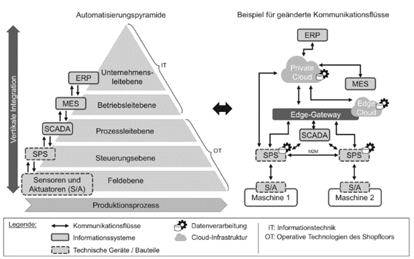
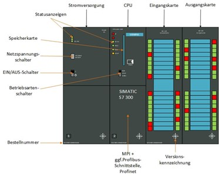
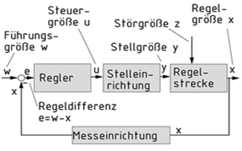
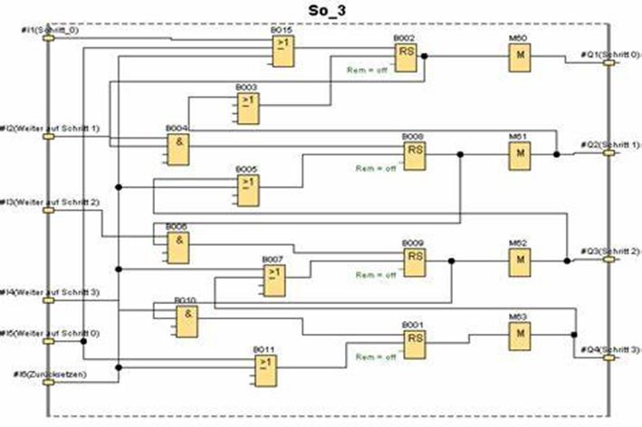

# Industrial IoT
Autoren: Philipp Boeroeczky, David Kier (Seite 11-15 des Foliensatzes), Daniel Zeljko

# Mechanisierung -> IIot
Der erste Schritt Richtung IIoT (Industrial Internet of Things) begann 1968, als der Ingenieur Dick Morley einen der wichtigsten Durchbrüche der Fertigungsgeschichte schaffte.

In diesem Jahr erfanden Morley und eine Gruppe von Geek freunden den Programmable Logic Controller (PLC), die in der Automatisierung von Fließbändern und Industrierobotern in Fabriken unersetzlich wurde.

- 1968: Dick Morley stellt den Programmable Logic Controller (PLC) vor, den industriellen Steuerungscomputer, welcher Eingänge überwacht und Anpassungen auf der Grundlage anpassbarer Programmierung vornimmt.
- 1983: Ethernet wird standardisiert
- 1986: PCs werden an SPSen angeschlossen.
- 1989: Tim Berners-Lee erstellt das Hypertext Transfer Protocol (HTTP)
- 1992: TCP/IP ermöglicht SPS-Konnektivität 
- 2002: Amazon Web Services startet und Cloud Computing beginnt Fuß zu fassen
- 2006: OPC Unified Architecture (UA) ermöglicht eine sichere Kommunikation zwischen Geräten, Datenquellen und Anwendungen.
- 2006: Geräte werden kleiner, Batterien und Solarenergie werden leistungsfähiger und sparsamer.
- 2010: Sensoren fallen im Preis, sodass sie in so ziemlich jede Anlage eingebaut werden können

Heute ermöglicht IIoT vielfältige Möglichkeiten der Fertigungsindustrie.
Es verändert das Fundament wichtiger Industrien, indem es eine neue Technologie ebenen hinzufügt, die Unternehmen dabei unterstützt, Betriebsabläufe zu optimieren, Anlagen zu verfolgen und zu analysieren, vorausschauende Wartung zu implementieren, riesige Datenmengen zu erfassen und Echtzeitentscheidungen zu treffen, die zuvor nie möglich waren.
[1]

# Industrial Internet of Things

Operative Technologien (OT) ist der Begriff für Hardware und Software, die die Leistung von physischen Geräten, Maschinen, Systemen und deren Prozessen und Ereignissen überwacht, kontrolliert und steuert.
In der Vergangenheit wurde operative Technologien (OT) fast ausschließlich zur Steuerung von Industrieanlagen eingesetzt und war im Gegensatz zur IT nicht mit dem Netzwerk verbunden. Die Werkzeuge, die zum Überwachen oder Anpassen von physischen Geräten, Maschinen und Produktionsanlagen verwendet werden, sind von Natur aus mechanisch, wobei sogar begrenzte digital gesteuerte Komponenten nur geschlossene Protokolle verwenden. Ihre Hauptaufgabe besteht darin, die permanente Verfügbarkeit von Maschinen und Anlagen sicherzustellen.
Da heute immer mehr physische Geräte mit dem Netzwerk verbunden sind, gibt es einen wachsenden Trend zur Konvergenz von OT und IT. Durch drahtlose Kommunikation in der OT wird es zukünftig auch möglich sein, aus großer Entfernung zu steuern und zu überwachen.
Alle Produktionsdaten physischer Anlagen können mithilfe von Big-Data-Systemen in Echtzeit verarbeitet und analysiert werden. Dies ermöglicht vorausschauende Instandhaltung und frühzeitige Fehler Erkennung und bedeutet eine deutliche Steigerung der Produktivität. Damit verschwinden die Grenzen zwischen OT und IT. Aus einem geschlossenen System wurde ein offenes System. Neue Geschäftsmodelle entstehen, Kosten können gesenkt und Services verbessert werden.
Die Weiterentwicklung des IoT wird diesen Trend stark beschleunigen. Denn nur eine enge Zusammenarbeit zwischen OT und IT kann langfristig ein effizientes und erfolgreiches IoT verwirklichen. Andererseits gehen Sicherheitsrisiken von Malware-Bedrohungen aus, die aufgrund ihrer geschlossenen Natur in den operativen Technologien bisher unbekannt waren. Als Beispiel können Berichte über gehackte Fahrzeuge dienen. Diese Bedrohung könnte sich auf kritische Infrastrukturbereiche wie Kraftwerke und Wasserwerke, militärische Anlagen und mehr ausbreiten. Hier sind sowohl Unternehmen als auch Regierungen gefordert, umfangreiche Sicherheitsmechanismen bereitzustellen, um den Zugriff Dritter oder gar die Übernahme sensibler und sicherheitskritischer Bereiche zu verhindern. Experten beider Seiten müssen lernen, sich neuen Herausforderungen stellen und zusammenarbeiten, um die Grundlage für die Veränderungen zu schaffen, die das Internet der Dinge mit sich bringt.
[2]

# 2 Automatisierungssysteme

Das Industrial Internet of Things (IIoT) ist eine Unterkategorie des Internet of Things (IoT). Der Fokus liegt nicht auf anwender- oder verbraucherorientierten Konzepten, sondern auf Anwendungen und Prozessen in Industrie- und Fertigungsumgebungen. IIoT ist eine Schlüsseltechnologie für die digitale Transformation und Industrie 4.0. Sie soll durch Vernetzung und Automatisierung für höhere Produktivität, höhere Effizienz, schnellere Prozesse und niedrigere Kosten in Industrie und Industrieprozessen sorgen. Zudem sollen mit dem Industrial Internet of Things neue Geschäftsmodelle und Geschäftsmöglichkeiten realisierbar werden. Unternehmen erwarten positive Auswirkungen auf Wettbewerbsfähigkeit, Wachstum und Zukunftsfähigkeit.
Industrial IoT wird in vielen verschiedenen Bereichen und Industriezweigen eingesetzt. Industrial IoT wird beispielsweise in produzierenden Unternehmen, der Landwirtschaft, dem Automobilumfeld, der Öl- und Gasindustrie, der Elektronikindustrie, Logistikunternehmen oder Energieversorgern eingesetzt. Vernetzte Sensoren spielen eine zentrale Rolle und ihre Daten bilden die Basis für automatisierte Steuerung und intelligente Prozesse in industriellen Anlagen und Maschinen. Intelligente Maschinen sollen schneller, präziser, effizienter und kostengünstiger sein als Menschen und manuell gesteuerte Prozesse. Die Anwendungstechnologien des IIoT sind mobile und kabelgebundene Netzwerke, Big Data, cyber-physische Systeme (CPS), Cloud Computing, Edge Computing, künstliche Intelligenz (KI) und maschinelles Lernen (ML).[3]

Die 10 am weitesten verbreiteten Anwendungsmöglichkeiten dieser Technologie:
- Intelligente Anwendungen zur Lagerung
- Präventive Wartung und Fernwartung von Maschinen
- Vernetzte Logistik
- Intelligente Messung aller logistischen Prozesse
- Intelligente Landwirtschaft und Kontrolle der Viehzucht
- Industrielle Sicherheitssysteme
- Optimierung des Energieverbrauchs
- Überwachung von Produktionsanlagen
- Asset Tracking und intelligente Logistik
- Gesundheit und Sicherheit der Bediener

# Automatisierungssystem
Prinzipiell kommuniziert der Anwender entweder über die Supervisory Control and Data Acquisition (SCADA) oder über eine Human-Machine-Interface (HMI) mit dem System. Die Steuerungsanweisungen bzw. die Logik dahinter werden mittels PLC bzw. anderer technischer Steuerkomponenten wie Mikroconrollern realisiert. Üblicherweise sind sowohl SCADA/HMI und die Steuerung, als auch die sensorischen oder schaltenden Bestandteile des Systems über ein Bussystem verbunden. Somit wird ein physikalischer Prozess (-schritt) im beliebigen Ausmaß automatisiert. Je höher der Grad der Automatisierung ist, desto weniger manuelle Handlungen müssen gesetzt werden um denselben Prozess wie gehabt weiter betreiben zu können. Bei einer optimalen Umsetzung wird der Prozess in der Regel sogar optimiert und rückt im Rahmen des magischen Dreiecks der Prozessoptimierung entweder näher an ein gewünschtes Eck (Qualität/Zeit/Kosten) oder bewegt sich in Richtung der Mitte. [4][5]

# Anlagenlebenszyklus
Der Lebenszyklus einer Anlage kann analog zu jenem eines Produktes abgebildet werden, ist allerdings etwas komplexer zu betrachten. Während ein Produkt hauptsächlich ersetzt wird falls die technologischen Aspekte nicht mehr die gewünschten Standards erfüllen, bedarf es bei Anlagen etwas genaueren Konsiderationen. In der heutigen Welt wo die Industrie 4.0 weitgehend etabliert wird und zunehmend auf komplexere Technik, sowie tiefergehende Vernetzungen gesetzt wird, muss der Anlagenbetreiber früher oder später mitziehen, um seine Wettbewerbsfähigkeit zu erhalten, denn in der Produktion können bereits minimale technische Rückstände zu immensen Verlusten führen. [6]

# Automatisierungspyramide:
## Erklärung:
Das Konzept der Automatisierungspyramide ist eine Veranschaulichung der hierarchisch aufgebauten Kommunikationsflüsse, wie sie in den Anfangsjahren der Automatisierung konzeptioniert wurde. Durch den Wandel der Produktion in Richtung Industrie 4.0 wird das Konzept der Automatisierungspyramide immer mehr aufgebrochen, da das Ziel der Industrie 4.0 eine systemübergreifende Vernetzung anstrebt.
## Aufbau der Pyramide:

Die in der linken Seite gezeigten fünf Ebenen lassen sich grob in IT (Informationstechnik) und OT (operative Technik) kategorisieren. Die IT beinhaltet die Unternehmensleit- und Betriebsebene wobei die OT die Prozessleit-, Steuerungs- und Feldebene beinhaltet. Im IT-Bereich sind Informationssysteme angesiedelt, welche für die Produktionsplanung zuständig sind. In der OT hingegen sind Systeme, die die Produktion selbst, also Maschinen, Prozesse und Abläufe, überwachen, steuern und durchführen. Jede Ebene in der Pyramide kommuniziert jeweils nur mit der darunter und darüber liegenden Ebene.
## Industrie 4.0 Automations-“Pyramide“:
Durch die hierarchische Gliederung der Pyramide wird der direkte Informationsaustausch zwischen nicht benachbarten Ebenen erschwert. Dies führt zu einer Entwicklung, die mehr durchwachsene Kommunikationsstrukturen innerhalb einer Produktion zulässt. In diesem System ist es wichtig, dass Sensordaten sowie alle anderen gesammelten Daten mit allen anderen vernetzt werden, da diese gesammelt und analysiert werden sollen. Diesen Vorgang nennt man auch Harmonisierung, welcher durch das Verwenden von cloudgestüzter Kommunikation ermöglicht wird.
[7]
# Zellen und Teilnetze:
Unter Teilnetzen innerhalb einer Produktion versteht man die unterschiedlichen, meist direkt voneinander abgekapselten Netze, welche die Kommunikation innerhalb einer Produktion sowie nach außen hin gewährleisten und meist über eine Ethernet-Verbindungen ablaufen. Bei Kommunikationssystemen wie dem etablierten Branchenstandard Profinet, wie auch bei den meisten Ethernet-Basierten werden die Netzteilnehmer mit IPv4 Adressschema adressiert wobei, wie bereits erwähnt wurde, die Netze voneinander in sogenannte Zellen (Aufgabenbereiche) aufgetrennt sein müssen und nur durch Gateways verbunden werden. Dies ist notwendig, da für gewöhnlich keine kompatiblen Protokolle in anderen Netzen als dem eigenen verwendet werden. [8]
#PLC
Die Abkürzung PLC steht für Programmable-Logic-Controller oder zu Deutsch auch SPS (Speicher-Programmierbare-Steuerung) und bildet das Herzstück einer jeden modernen Automatisierungsanlage. Wie auch bei den Kommunikationssystemen ist auch bei den PLCs die Firma Siemens der globale Markführer und setzt mit der Simatic S7 Serie den Industriestandard für SPSen. Die SPS wie auch jedes andere Automatisierungswerkzeug hat in den letzten Jahren drastische Veränderungen in internen als auch in den externen Fähigkeiten erlebt.j
Wo frühere SPSen wie die S5-100U selbst nur aus dem Prozessor, wenigen digitalen sowie analogen Ein- und Ausgängen, einer Netz-Schnittstelle bestand und nur über ein eigenes Programmiergerät, DOS-basiert, angesteuert und programmiert werden konnte, sind die aktuellen Möglichkeiten vergleichsweise unbegrenzt.
Dass SPSen früher nur mittels Programmiergeräten (Terminal) programmiert werden konnten, wäre für heutige Maschinen beinahe undenkbar. Heutzutage dient das TIA-Portal für alle modernen Siemens SPSen als universelles Tool zur Konfigurierung, Programmierung und Visualisierung von SPS-Abläufen und Programmen via Ethernetanbindung.
## Aufbau einer modernen SPS:
SPSen verfügen in der Regel über gewisse Grundausstattungen:

 
-	CPU
-	Indikatior-LEDs
-	Speicherkarten-Slot
-	Spannungsversorgung
-	Hardware-Schalter
-	Feldbusanschluss
-	Ein- und Ausgängen (analog und digital)

SPSen lassen sich grob gesprochen in modulare und kompakte SPSen unterteilen:
-	Modulare SPSen bestehen aus einem Controller (der SPS selbst) und vielen an diesen anschließbaren (modularen) Komponenten. Wenn man sich zur Veranschaulichung den Siemenskatalog heranzieht, so findet man anbindbare Baugruppen von Signal-, Funktions- bis hin zu Kommunikationsbaugruppen in verschiedensten Ausführungen. 
Beispiele für diese Bauform wäre die SIMATIC S7-1500 Open Controller[9]

-	Kompakt-SPSen sind tendenziell kostengünstiger, da die wesentlichsten Grundkomponenten bereits verbaut sind. Für weniger komplexe Produktionssysteme sind diese für gewöhnlich vollkommen ausreichend. Wie bei modularen SPSen (mit Ein- und Ausgangsmodul) haben Kompaktsteuerungen meist digitale wie auch analoge Ein- und Ausgänge fest verbaut.[10]
# Realtime:
SPSen funktionieren im gegensatz zu einem „normalen“ Computer mit ablaufenden Programmen nicht linear sondern zyklisch. Während eines SPS-Zyklus laufen folgende Schritte ab:
-	Clock-Interrupt erkennen und neuen Zyklus triggern
-	Einlesen und determinieren der Ist-Zustände der Eingänge und des Betriebszustandes
-	Übersetzten der Eingänge in digitale Merker/Signale via A/D Konverter
-	Bearbeiten des User-Programmes
-	Via A/D Konverter digital gesetzte Ausgänge auch an den Ausgängen setzten
-	Controller-Variablen setzten 
-	Neuen Zyklus aufrufen[11]

Echtzeit(-Anforderungen) sind jedoch keine eindeutige Zeitangabe sondern eine Bereitsstellungsaussage über die maximal beanspruchte Zeit wobei man zwischen drei verschiedenen Anforderungen unterschieden:
-	Der harten Echtzeit (definierte Reaktionszeit wird nie überschritten)
-	Weiche Echtzeit (geforderte Reaktionszeit wird nur statistisch gewährleistet)
-	Feste Echtzeit (strengere Reaktionszeitanforderungen als bei der Harten) [12]

# Continuous Plant 
Die Hauptaufgabe eines Automatisierungssystems in durchgehenden Werken, ist nicht nur die Steuerung, sondern auch die Regelung verschiedener Parameter zur Gewährleistung eines sicheren und effizienten Betriebs. In der hier angeführten Abbildung sieht man den schematischen Aufbau einer Regelstrecke, welche in unserem Beispiel die Regelung von einer SPS durchgeführt werden würde. Beispiele für Parameter, die einer Regelung bedürfen sind Temperaturen, Geschwindigkeiten oder auch strombezogene Größen. [13][14]

 
# Discrete Plant
In Abgegrenzten Prozessen, ist es hingegen wichtiger das Controlling in einzelnen Sequenzen zu realisieren. Ein Schrittkettenprozess mit teilweise parallelen Schritten wie beispielsweise eine Ampel oder der Ablauf einer Warenkommission findet hierbei statt. In der angeführten Abbildung erkennt man solche Schrittkettenprozesse in Form eines Programmaufbaus bei einer Siemens Logo[14][15]

 
# IEC 61131 Programm Languages
Die hier betitelte Norm ist die einzig weltweit gültige Norm für Programmiersprachen von speicherprogrammierbaren Steuerungen. Sie beinhaltet die folgenden 5 verschiedenen Sprachen, in denen programmiert werden kann, vorausgesetzt man geht von klassischen SPSen unter der Anwendung von Siemens Software aus. 
Bei AWL (Anweisungsliste) handelt es sich um eine sehr maschinennahe textbasierte Programmsprache, sie ist vergleichbar mit G-Code bei CNC Anwendungen.
FUP (Funktionsplan) hingegen ist eine grafikbasierte Programmsprache, die sich jedoch im Gegensatz zu KOP, nicht den alteingesessenen Schließer- oder Öffner-Tastern oder Schaltern bedient. FUP ist zudem die meistgenutzte Sprache zur Programmierung von SPSen. Gerade für Neueinsteiger ist Funktionsplan vermutlich am einfachsten zu erlernen, da man einen sehr guten Überblick über die Bestandteile, Konfigurationen und Parameter der Logik erhält.
Der sogenannte KOP (Kontaktplan) ist ähnlich wie FUP ebenfalls eine grafikbasierte Programmsprache, wobei die Kontaktpläne den Schaltplänen in der Elektrotechnik sehr ähnlich bis ident sind, aber auch hier können Blöcke eingefügt und parametrisiert werden.
SCL (Structured Text) ist eine von Siemens entwickelte Programmiersprache, die vollständig auf Text basiert ist und kommt am nächsten an eine Hochsprache wie C, Java oder andere heran, daher ist sie für IT-orientierte Benutzer am intuitivsten.
CRM (Cause Result Matrix) ist grundsätzlich aufgebaut wie eine Excel Tabelle, in den Spalten am oberen Rand des Bildschirms stehen die Ergebnisse und in den Zeilen linkerhand sind die möglichen Ursachen aufgelistet. Um ein Ergebnis vollständig zu verknüpfen, bedarf es der Herstellung einer Verbindung von den Ereignissen zu den jeweiligen Ausgängen.
Programme in der Totally Integrated Automation IDE (TIA-Portal) werden in der Main-Funktion (zyklischer SPS-Durchlauf) ausgeführt, welche sich wiederum in Funktionsbausteine gliedert, die jeweils in einer Programmiersprache geschrieben werden. Eine Besonderheit bei den einzelnen Bausteinen ist jedoch, dass man Einschübe innerhalb eines Funktionsbausteins ergänzen kann, welche jeweils in einer anderen Sprache ausprogrammiert werden können. [16]
# IEC 61131 Execution engine
Der interne Aufbau des Herzstücks einer SPS besteht, wie bereits kurz angesprochen aus den Programmen, welche gewisse Tasks enthalten und aus Funktionsbausteinen zusammengesetzt werden. Diese „Ressourcen“ werden in der Konfiguration, zusammen mit der Hardware über die entsprechende Software definiert. Die Verbindung nach Außen wird über die access paths gewährleistet, welche im Regelfall die I/Os der Steuerung repräsentieren, aber auch zu anderen Steuerungen oder zum übergeordneten System bestehen können. [17]

# 61131 Programming environment
Die Programmierung kann über mehrere Geräte erfolgen. Das gilt sowohl für das Gerät, auf welchem die logischen Abläufe erstellt werden, als auch für die Steuerungen, in welche das Programm schlussendlich eingefügt wird. Am gängigsten ist es, die Logik auf einem Laptop herzustellen. Das hat den Vorteil, dass man das Gerät aufgrund der Portabilität auch am Feld mitführen kann, um Änderungen zu gewährleisten bzw. Fehlerdiagnosen und Behebungen durchführen zu können. Als Verbindung zwischen den Hardwarekomponenten wird hauptsächlich ein Ethernet Kabel eingesetzt, es kann jedoch auch über Clouds eingespielt und Diagnosen oder Manipulationen können vorgenommen werden.
Oftmals wird die Programmierung auf einer Virtuellen Maschine vorgenommen, da die Lizenzen der Software einer Firma aus Kosten- oder Speicherplatzgründen oft auf einer solchen Maschine liegen.
Es empfiehlt sich bei größeren Inbetriebnahmen oder Erweiterungen von bestehenden Systemen zunächst ein ausführliches Debugging vorzunehmen, um Wechselwirkungen mit dem existierenden Part zu vermeiden oder die Anlage ungeplant außer Betrieb zu nehmen.
Man kann sowohl in einer Art Elektrotechnik-Laboratorium eine Hardware-Simulation aufbauen, indem man die Komponenten tatsächlich aufbaut und mit einem Netzteil die Eingänge bespeist, oder man führt in der Programmierumgebung eine Simulation durch und verändert mittels Forcen/Steuern die Anschlüsse der Steuerung. Für diese Funktion befindet sich im Projekt-Dropdown einen eigenen Menüpunkt auf TIA. In einer speziellen Ansicht lassen sich die Veränderungen im Programm beobachten und bei Fehlfunktionen die Logik nachbearbeiten.[14][18]

[1]https://www.visualcapitalist.com/timeline-industrial-internet-things/

[2]https://www.it-business.de/was-ist-operational-technology-a-796867/

[3]https://www.security-insider.de/was-ist-das-iiot-a-5456ae4e4b1b4bf2cb983a5912bd6382/

[4]https://www.ingenieur-buch.de/media/blfa_files/9783446426757-Leseprobe.pdf

[5]https://roarsimulation.com//blog/to-simulate-or-not-to-simulate-that-is-the-question

[6]https://www.bigdata-insider.de/der-anlagenlebenszyklus-schreit-nach-digitalisierung-a-894511/

[7]	(Weber, Konzeption und Realisierung einer Plattform zur Verwaltung von Modellen des maschinellen Lernens im Kontext von Industrie 4.0, 2021)

[8]	(https://mall.industry.siemens.com/mall/de/ww/catalog/products/9309999?activeTab=order&regionUrl=/, 2022)

[9]	(https://mall.industry.siemens.com/mall/de/de/Catalog/Products/5000042, 2021)

[10]	(https://www.sps-lehrgang.de/sps/, 2021)

[11]	(Dirnberger, Dirnberger2018-4_Industrielle Automatisierungssysteme.pdf, 2018)

[12]	(Wörn, Echtzeitsysteme, Grundlagen, Funktionsweise, Anwendungen, 2005)

[13]https://glossar.item24.com/glossarindex/artikel/item/regelkreis.html

[14]Dirnberger, Dirnberger2018-4_Industrielle Automatisierungssysteme.pdf, 2018

[15]www.wm27k2mv o.homepage.t-online.de/8-LOGO-8

[16]https://www.sps-tutorial.com/programmierprachen/

[17]https://www.elektrotechnik.vogel.d e/was-ist-eine-sps-definition-grundlagen-und-funktion-a-773404/

[18]Erfahrungen aus Praktika in technischen Unternehmen

