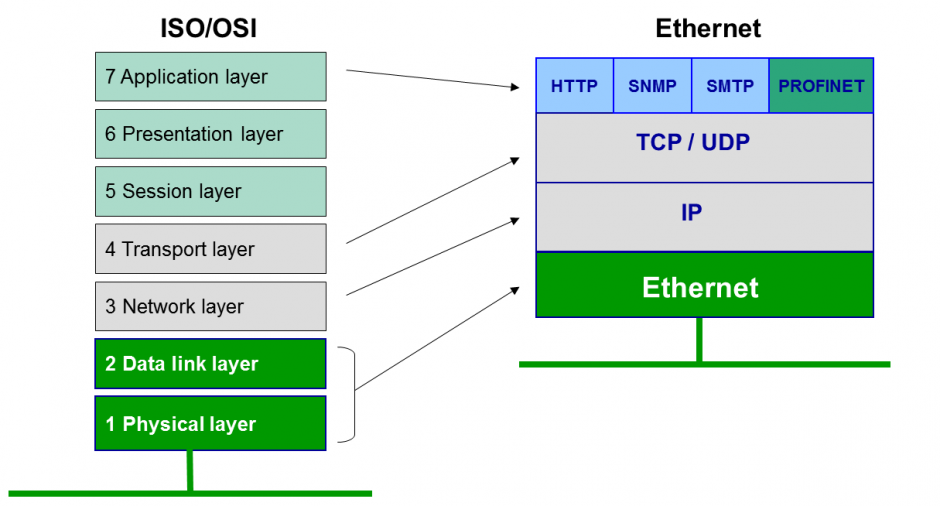
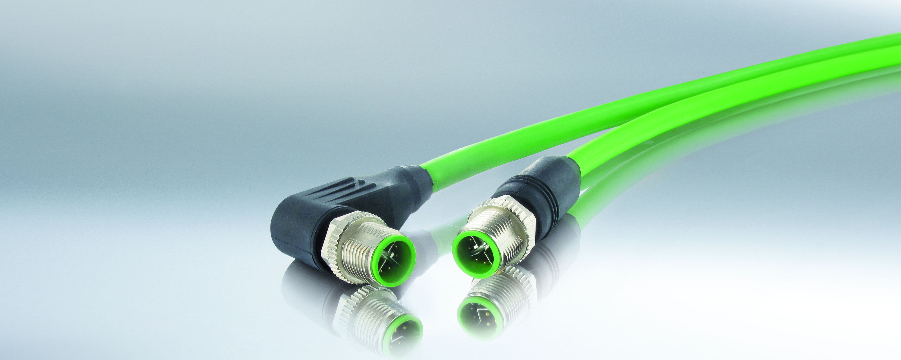
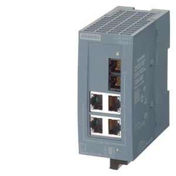
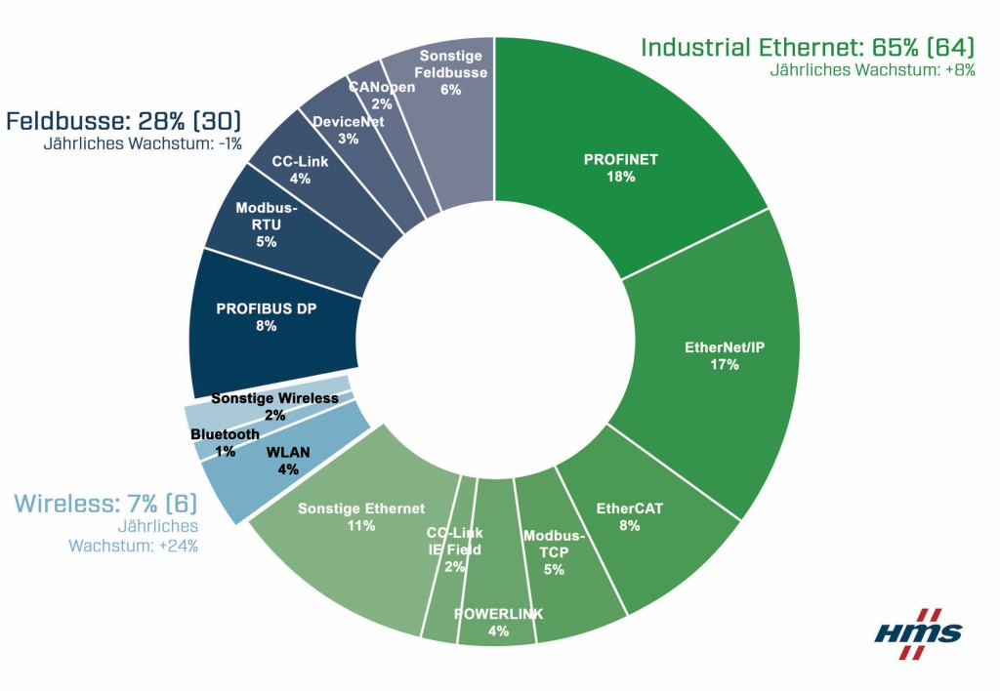
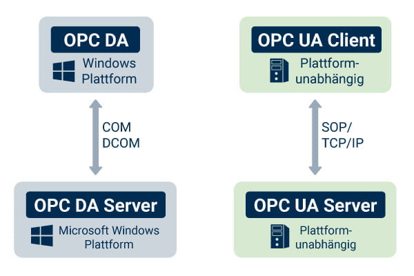
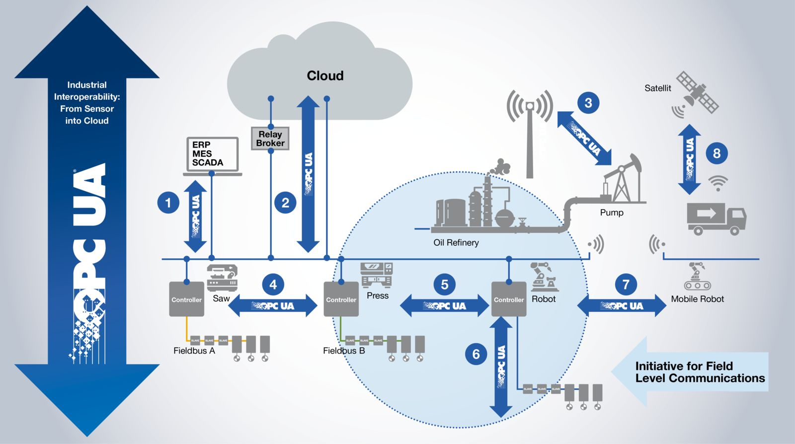

# Industrial IOT Advanced

Autoren: Martin Pichler, Marjanov Florian, Gruber Andreas (Industrial Etherned, OPC UA)

# Industrial Ethernet  

## Begriffserklärung  

### Ethernet: Dabei handelt es sich um die untersten zwei Schichten des ISO/OSI Modells. [1][18]  
+ Layer 1 (Physischer Layer): Diese ist für die Übertragung der Bits zuständig. 
Diese besteht meist aus einem Kupfer- oder Glasfaserkabel und es handelt sich daher um ein elektrisches oder optisches Signal. 
Zu den Komponenten zählt weiters noch Hardware wie Hubs, Stecker, Patch-Panele, etc  
+ Layer 2 (Data Link Layer): Dieser Layer ist dafür zuständig, dass die Daten zuverlässig ankommen. 
  Fehlererkennung und Fehlerbehebung der übertragenen Pakete werden in dieser Schicht durchgeführt. 
  Die Pakete sind auch in ihrer Größe beschränkt und müssen daher fragmentiert werden. 
  Auch der Zugriff wird auf Layer 1 durch diese Schicht geregelt. 
  Als Komponenten sind hier Switches und Bridges zu finden.  
  [10]
  
+ Industrial Ethernet: Ethernet hat sich im IT-Umfeld etabliert und stellt daher den weit verbreitetsten Netzwerk-Technologie-Standard dar. 
Industrial Ethernet ist also eine Weiterentwicklung des Ethernet-Standards, um den Anforderungen in der Industrie gerecht zu werden. [2] 
Unter Leitung der IAONA (Industrial Automation Open Networking Alliance) wurde die Forschung dafür vorangetrieben, um eine Grundlage für ein robustes und echtzeitfähiges Protokoll zu legen. 
Diese Netzwerke werden in drei Ebenen unterteilt: Leit-, Steuer- und Aktor-/Sensorebene [5]. Auch zwischen diesen Ebenen soll uneingeschränkt kommuniziert werden können.  

## Anforderungen  

### Einheitliches Protokoll  
Andere in der Industrie eingesetzte Netzwerke (Feldbus zB: INTERBUS, ControlNetm SERCOS I & II [3]) greifen auf verschiedene Soft- und Hardwarelösungen zurück. 
Dadurch werden für eine Interoperabilität zwischen den Steuerungen, den Sensoren und den Aktoren verschiedene Kommunikationsmodule vorausgesetzt. 
Hier setzt Industrial Ethernet als Basis TCP/IP ein.  

### Mechanik  
Netzwerkkomponenten aus den 802.3-Ethernet-Standards halten nur den Bedingungen aus dem Büroalltag stand. 
Hier wurde zu dem RJ45-Stecker der M12-Steckverbinder entwickelt.[4] Dieser hält Staub, Schmutz und Nässe fern und minimiert auch die Gefahr einer Beschädigung durch Zug, Druck, etc. 
Auch weitere Netzwerkkomponenten in den Schaltschränken, wie zB: Hubs, müssen anderen Bedingungen stand halten. Ebenfalls muss die Montage in Schaltschränken möglich sein.  
[4] [9]

### Echtzeitdatenübertragung  
Wie auch in Kapital 4 beschrieben, gibt es definierte Rekationszeiträume, welche bei Steuerungssystemen eingehalten werden müssen. 
Das muss auch über alle drei Netzwerk-Ebenen gewährleistet werden. [6]  

## In der Praxis  
Circa 2/3 der Anlagen im Jahr 2021 werden mit Industrial Ethernet gesteuert. 
Die Erwartung ist, dass der Marktanteil weiter wachsen wird.[8] Am Stärksten vertreten sind PROFINET und EtherNet/IP.  
Auch der Anteil von kabellose Netzen ist ständig am Wachsen, da in den Produktionshallen immer mehr autonom fahrende Helfer unterwegs sind, um die Produktionsprozesse zu automatisieren.  
[8]  

# OPC UA  
OPC UA ist kurz für Open Platform Communications United Architecture. 
Es ist der offene Kommunikationsstandard, der spätestens in der Industrie 4.0 gefordert wurde.  

## Warum?  

Der Vorgänger war OPC und basierte auf Microsofts Kommunikationsstandard COM/DCOM, dessen Quellcode nicht öffentlich war. Dagegen basiert OPC UA auf reinen TCP/IP oder SOAP-Webservice (Simple Object Access Protocol). [11]  Durch die binäre TCP/IP-Übertragung soll der overhead auf einem Minimum gehalten werden.

[11]  

Mithilfe dieses Protokolls soll es möglich sein, dass einzelnen Sensor bzw Aktor nicht nur mit dem jeweiligen Steuerungssystem zu kommunizieren, sondern direkt mit Datenbanken bzw mit den gewünschten Clouddienst.  
[12]  

## Architektur

Es gibt hier zwei Mechanismen: [13]  

+ Client-Server-Modell, welches UDP und AMQP (Advanced Message Queuing Protocol) unterstützt. [14]  
+ Publisher-Subscriber-Modell, welches MQTT benützt.  

Beide können auf zwei Varianten kommunizieren:  

+ Peer-to-peer-Kontext, für eine gesicherte Übertragung an bestimmte Geräte  
+ Broadcast-Verteilung, für den Informationsaustausch an alle ohne Bestätigung  

## Sicherheit  

OPC UA ist mit einem Höchstmaß an Sicherheit entwickelt worden, jedoch kann mit Standard-Netzwerktechniken die Verbindung eingerichtet und kontrolliert werden. [11] Dadurch stellen auch Firewallkonfigurationen keine Herausforderungen dar. Für die sichere Datenübertragungen sind mit Authentifizierung, Verschlüsselung und Signaturen alle üblichen IT-Mechanismem an Board.

## Kommunikation mit PLCopen  

PLCopen ist eine Organisation für industirielle Steuerungstechnik. Gleichnamig ist eine offene Firmware für Steuerungstechnik, welche vorallem für Aktuatoren entwickelt wurde. Durch die Zusammenarbeit von UPC UA und PLCopen wurden die Spezifikationen von OPA UA adaptiert. [15]  

Somit wird die barrierefreie Kommunikation gewährleistet, sodass bei den führenden SPS-Herstellern bereits Bibliotheken zur Verfügung stehen. [16]

## In der Praxis  

2018 soll der Marktanteil bei circa 25% liegen, damals wurde bereits erwartet, dass der Anteil bald auf 42% ansteigen wird. [17]  

[1]: https://dev-supp.de/netzwerk-anonymitaet/iso-osi-referenzmodell  
[2]: https://www.kunbus.de/industrial-ethernet-warum-i.html  
[3]: https://www.elektrotechnik.vogel.de/feldbus-vs-industrial-ethernet-a-432646/  
[4]: https://www.murrelektronik.at/at/produkte-branchen/produkt-news/detail/news/m12-steckverbinder-fuer-industrial-ethernet/  
[5]: https://www.ihks-fachjournal.de/industrial-ethernet-ein-netz-fuer-alle-anwendungsfaelle/?q=industrial%20ethernet  
[6]: https://www.feldbusse.de/trends/status-ethernet.shtml  
[7]: https://git.nwt.fhstp.ac.at/lbdirnberger/enterprise-iot/-/blob/master/0x04_iiot.md  
[8]: https://www.vdi-nachrichten.com/technik/automation/ethernet-und-funknetze-legen-weltweit-in-der-industrie-zu/  
[9]: https://shop.osd-schenck.de/epages/es549793.mobile/de_LU/?ObjectPath=/Shops/es549793/Categories/Nach_Hersteller_sortiert/Siemens/Industrial_Ethernet  
[10]: https://www.all-electronics.de/automatisierung/industrial-ethernet-272.html  
[11]: https://www.opc-router.de/was-ist-opc-ua/  
[12]: https://www.br-automation.com/de/technologie/opc-ua/haeufig-gestellte-fragen-zu-opc-ua-over-tsn/  
[13]: https://www.industry-of-things.de/was-ist-opc-ua-definition-architektur-und-anwendung-a-727188/  
[14]: https://de.wikipedia.org/wiki/Advanced_Message_Queuing_Protocol  
[15]: https://www.rfid-wiot-search.com/de/opc-foundation-und-plcopen-veroeffentlichen-neue-spezifikationsversion-2854  
[16]: https://infosys.beckhoff.com/index.php?content=../content/1031/tf6100_tc3_opcua/633776523.html&id=  
[17]: https://www.industrielle-automation.net/sps-studie-trend-zu-opc-ua-und-cloud/  
[18]: https://www.ionos.at/digitalguide/server/knowhow/das-osi-modell-referenz-fuer-standards-und-protokolle/  

## IoT bzw IIOT
Unter IoT bzw IIoT versteht man „Internet of Things“ bzw das weitere I davor für Industrial. Es handelt sich dabei um die Verknüpfung und Kommunikation von Hardware (Sensoren, Aktoren, Netzwerkkomponenten, etc), welche für das Aufzeichnen, Ausführen und auch Auswertung von Daten verantwortlich sind. Diese Daten können sowohl an der Edge, im Fog oder in der Cloud ausgewertet werden. Durch die Vernetzung von Geräten können Prozesse digitalisiert und durch die damit erhaltenen Daten „intelligent“ verknüpft und automatisiert werden. In der Industrie wird es auch als vierte Welle der industriellen Revolution mit dem Titel Industrie 4.0 bezeichnet. [19]

[31]

### Cloud Computing
Unter Cloud Computing versteht man, dass die Daten nicht vor Ort verarbeitet oder gespeichert werden, sondern dass diese in die Cloud, also zB an eine physisch ausgelagerte Serverfarm oder Rechenzentrum, gesendet werden. Der Vorteil ist, dass man als Firma die Kapazitäten für Rechenleistung oder Speicher bei einer externen Firma zukaufen kann und somit nicht verantwortlich ist für das Erhalten der Infrastruktur. Je nachdem, wie viel Rechenleistung man braucht, kann diese aufgestockt werden. [21]

Populär wurde Cloud Computing mit der nahezu sofortigen Übertragung der Daten durch hohe Übertragungsraten. Da es ein Sammelbegriff ist, kann es mit folgenden Punkten zusammengefasst werden:
-	On-Demand Self-Service: Nutzer können selbstständige mehr Ressourcen anfordern ohne Autorisierung
-	Broad Network Access: Zugang zur Cloud funktioniert über das Internet, keine Nischentechnologie benötigt
-	Resource Pooling: Die Kapazität der Rechenleistung in Serverfarmen werden dynamisch vergeben. Daher ist ein Server nicht physisch an eine Firma gebunden, sondern werden im Pool mit anderen geteilt.
-	Rapid Elasticity: Die angeforderten Kapazitäten werden automatisiert und in Echtzeit vergeben.
-	Measured Service: Die Nutzung der Cloud wird getrackt und daher der Prozess transparent dargestellt

Für Cloud Computing gibt es auch mehrere verschiedene Schichtmodelle als Angebot:
-	Infrastructure as a Service (IAAS): Auf dieser Ebene wird nur die Hardware und Infrastruktur angeboten
-	Platform as a Service (PAAS): Auf dieser Ebene wird zusätzlich zur Hardware auch die Softwareseitige Umgebung gewartet, upgedatet und instandgehalten.
-	Software as a Service (SAAS): Hier wird alles in einem Paket angeboten. Vorteilhaft für Endkunden, die sich um nichts kümmern müssen. Auch die Software wird bereitgestellt.

[22] [23]

### Edge Computing
Unter Edge Computing versteht man die Ausführung eines Workloads auf Edge-Geräten. Edge Computing wurde in den letzten Jahren populär, da die Bandbreite immer mehr mit Datenübertragungen belastet wurden. Die Hauptgründe für den Einsatz der Edge ist die Zeitrelevanz und das Datenvolumen. Somit werden die Daten vor Ort an der Edge verarbeitet und dann erst an die Cloud gesendet. [24]

### Fog Computing
Der Terminus Fog Computing wurde ursprünglich von Cisco geprägt und sollte eine Alternative zu Cloud Computing sein. Mittlerweile ist es eine Erweiterung von Cloud Computing. Es wird als dezentralisierte Computing Struktur beschrieben und befindet sich zwischen der Cloud und dem Edge, also Geräte bzw Sensoren, welche Daten produzieren. 
Da die Datenübertragungsmenge limitiert sind, hat sich von Edge Computing, welche die Daten nach der Verarbeitung direkt in die Cloud sendet, Fog Computing begonnen zu etablieren. Da es immer mehr und mehr Edge Devices gibt, konnte die Datenmasse nicht mehr in Echtzeit an die Cloud gesendet werden. Um dieses Problem zu beheben, wurden zwischen dem Cloud Datencenter und den Edge Devices Fog Nodes zwischengeschaltet, welche Daten analysieren und die wichtigen an die Cloud weiterreichen. Damit wird die Datenübertragungsmenge limitiert und unwichtige Daten herausgefiltert. [26]

## Hardware
Um die vernetzten Geräte umzusetzen, muss die Industriehardware angepasst werden. So können SPS nicht nur Aktoren ansteuern und Sensoren auslesen, sondern sind mit einem Ethernetport versehen, der den Echtzeit-Datenzugriff und -Steuerung möglich macht. Diese nennt man auch IoT-Controller. [27]

[32]

### HMI, Dashboards, SCADA
Die Daten der Sensoren und Aktoren können in einem HMI (Human Machine Interface) abgebildet werden. Ein traditionelles HMI wird vor Ort an der Maschine verbaut, dass die Bediener der Maschine diese im Betrieb bedienen und Informationen über den Echtzeitbetrieb so wie Fehlermeldungen auslesen können.
Ein SCADA System ist, wie der Name Supervisory Control and Data Acquisition schon sagt, ein System zur Überwachung und Steuerung von industriellen Anlagen. Angebunden sind die SPS mit einem OPC-UA fähigem Gerät, welches wiederum mit dem SCADA-Server verbunden sind. Der SCADA-Client greift darauf auf diesen Server zu.

[33]

Im Bereich Industrie 4.0 etabliert sich zusätzlich zum klassischen HMI grafische Dashboards, welches Daten auf einem Zeitstrahl abbildet. Durch die Vernetzung kann dieses Dashboard nicht nur vor Ort an der Maschine angezeigt werden, sondern über das Internet überall darauf zugegriffen werden. Zusätzlich können Schwellenwerte, welche durch KPIs (Key Process Indicators) berechnet, eingebunden werden und durch intelligente Verknüpfung der Daten automatisiert angepasst werden.

[28][29][30]

[19]: https://www.oracle.com/at/internet-of-things/what-is-iot/
[21]: https://www.ionos.at/digitalguide/server/knowhow/cloud-computing-definition-erklaerung-geschichte/
[22]: https://www.redhat.com/de/topics/cloud-computing/cloud-vs-edge
[23]: https://www.simplilearn.com/edge-computing-vs-cloud-computing-article
[24]: https://www.fis-gmbh.de/de/blog/cloud-computing-vs-edge-computing/
[25]: https://blogs.nvidia.com/blog/2022/01/05/difference-between-cloud-and-edge-computing/
[26]: https://www.ionos.at/digitalguide/server/knowhow/fog-computing-definition-und-erklaerung/ 
[27]: https://www.baunetzwissen.de/elektro/tipps/news-produkte/iot-controller-als-schnittstelle-5609289
[28]: https://www.onlogic.com/company/io-hub/de/was-ist-scada-automatisierung-und-wie-wird-sie-eingesetzt/
[29]: https://crushtymks.com/industrial-automation/1077-the-basics-of-hardware-and-software-for-scada-systems-you-should-know-about.html
[30]: https://www.copadata.com/de/produkt/zenon-software-platform-fuer-industrie-energieautomatisierung/visualisierung-steuerung/was-ist-scada/
[31]: https://www.thinkebiz.net/what-edge-computing/
[32]: https://www.renesas.com/us/en/application/industrial/industrial-network/industrial-ethernet-fieldbus#overview
[33]: https://www.copadata.com/de/produkt/zenon-software-platform-fuer-industrie-energieautomatisierung/visualisierung-steuerung/was-ist-scada/
