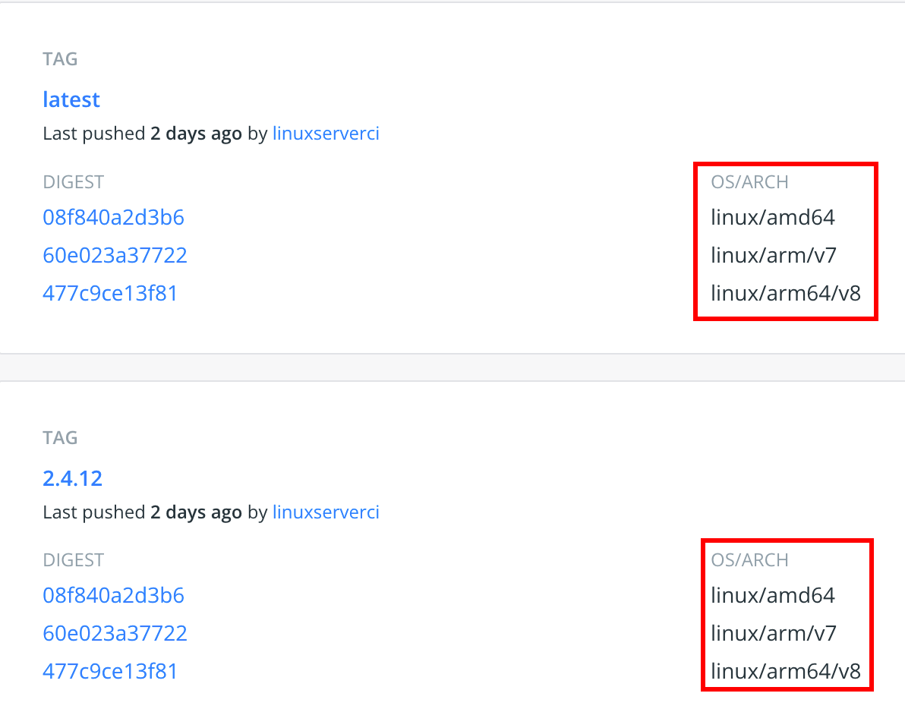

# Docker

## Was ist Docker?

Docker ist eine Container-Plattform. Sie ermöglicht es Applikationen in einer isolierten Umgebung zu virtualisieren. In einem Image werden alle Abhängigkeiten, die ein Programm benötigt, übertragen. Man benötigt nur eine Docker-Installation auf seinem Gerät und das Image. Docker und viele der hier vorgestellten Tools sind für den Privatgebrauch kostenlos.

### Unterschied zu VM oder LXC

Der größte Unterschied besteht zu virtuellen Maschinen (VM). Eine virtuelle Maschine hat das ganze Betriebssystem abgespeichert und benötigt neben meist mehreren Gigabyte an Speicherbedarf auch mehr Ressourcen. Container (LXC und Docker) haben nur einen Bruchteil davon, weil diese auf dem Kernel des Hosts laufen. Containerlösungen werden grundlegend als sicher betrachten, jedoch kann es im Vergleich zu VMs nicht so sicher sein, da eine Sicherheitsschicht wegfällt.

[1]

LXC steht für Linux Container. Grundlegend ähneln sich die Prinzipien beider Lösungen.  

Die wichtigsten Unterschiede:

+ Im Fokus des LXC-Containers steht das Betriebssystem auf dem weitere Programme installiert werden. Dies ist meist ein Linux (Ubuntu, Debian, etc) mit minimalen Anforderungen. Bei Docker gibt es ebenfalls diese Betriebssystem-Images um einen Container mit einen Linux-Betriebssystem zu starten. Docker ist jedoch dazu gedacht, dass jedes Image und damit jeder Container ein lauffähiges Programm installiert hat. Werden verschiedene Programme benötigt, werden mehrere Container gestartet.
+ Wird ein Docker-Container beendet, verliert er die Daten, die während der Laufzeit verändert wurden. Es können zwar `Volumes` eingebunden werden, in denen die Daten einen Neustart überstehen, aber der Container wird komplett neu aus dem Image gebaut. Aus dem laufenden Container kann ein neues Image erstellt, welches dann die veränderten Daten mit übernimmt. Ein LXC-Container dagegen verhält sich wie man es von einem normalen Betriebssystem gewohnt ist.
+ Wird aus einem Docker-Container ein Image erstellt, müssen nur die Änderungen gespeichert werden. Da Docker-Images auf Layer basieren, ist jede Änderung der Vorversion ein neuer Layer. 

[2]


## Docker Hub

Als Platform für den Austausch von Images gibt es [Docker Hub](https://hub.docker.com/). 


Dort sind Stand heute (06.06.2022) über 9 Millionen Images gelistet. Dies beginnt, wie oben genannt, bei Betriebssystemen, aber im Mittelpunkt stehen vorrangig Open-Source-Programme, wie Nextcloud, nginx, etc. 

Es ist auch möglich selbst erstellte Images hochzuladen und damit anderen zur Verfügung zu stellen:


## Starten eines Containers  

### docker run

Ist Docker am Gerät installiert, kann ein Container per Befehl in der Kommandozeile gestartet werden:

`docker run <IMAGENAME>:<VERSION>` beschrieben auf https://docs.docker.com/engine/reference/run/.  

Meistens muss bei erstellen eines Containers ein oder mehrere Parameter mitgegeben werden. Hier am Beispiel des Bookmarkmanagers [Heimdall](https://hub.docker.com/r/linuxserver/heimdall):

```
docker run -d \
  --name=heimdall \
  -e PUID=1000 \
  -e PGID=1000 \
  -e TZ=Europe/London \
  -p 80:80 \
  -p 443:443 \
  -v </path/to/appdata/config>:/config \
  --restart unless-stopped \
  lscr.io/linuxserver/heimdall:latest
```

`</path/to/appdata/config>` muss durch den Pfad ersetzt werden, in welchem die Konfiguration remanent abgelegt werden soll. Nach dem Download des Images wird der Container gestartet. Mit dem Versions-Tag kann eine bestimmte Version ausgewählt werden.  

### docker-compose

Um nicht die Kommandos in der Kommandozeilenumgebung umständlich editieren zu müssen, empfiehlt sich docker-compose. In einem Ordner muss die YAML-Datei `docker-compose.yml` angelegt werden und anschließend das Kommando `docker-compose up -d` im Ordner ausführen. Der Container wird wie bei `docker run` gestartet. Wird eine Anpassung an der YAML-Datei vorgenommen und wieder das Kommando ausgeführt, wird der aktuelle Container durch einen Neuen ersetzt.

```
version: "2.1"
services:
  heimdall:
    image: lscr.io/linuxserver/heimdall:latest
    container_name: heimdall
    environment:
      - PUID=1000
      - PGID=1000
      - TZ=Europe/London
    volumes:
      - </path/to/appdata/config>:/config
    ports:
      - 80:80
      - 443:443
    restart: unless-stopped
```

### Alternativen

Es gibt auch GUI-Tools, welche die Einrichtung eines Containers unterstützen. Zu den Bekanntesten zählen [Portainer](https://www.portainer.io/) und [Rancher](https://rancher.com/).  


## Prozessorarchitekturen  

Wie auch bei VM und LXC kann die Prozessorarchitektur nicht ignoriert werden. Wurde ein Container für Intel und AMD gebaut, wird dieser auch nur dort laufen. Jedoch können auf [Docker Hub](https://hub.docker.com/) zu einem Image  verschiedene Versionen hinterlegt werden.



Ebenfalls gut zu Erkennen sind die im Versions-Tags der Images.


## Images erstellen

### docker commit  

Ein laufender Container kann mit `docker commit <CONTAINERNAME>` zu einem Image umgewandelt werden.  

### docker build  

Da man jedoch in der Praxis einen fixen Ablauf an Schritten für seinen Container wünscht, macht es Sinn es in ein [Dockerfile](https://github.com/andig91/docker_build/blob/main/cloudscraper/Dockerfile) auszulagern und den Container mittels  `docker build .` zu bauen.

Das Dockerfile sieht wie folgt aus: [Beschreibung Dockerfile](https://docs.docker.com/engine/reference/builder/)

```
FROM debian:latest
#FROM ubuntu:latest #ausprobieren

RUN apt-get update && \
    apt-get install -y \
    python3 python3-pip && \
    pip3 install cloudscraper

ENTRYPOINT []
CMD ["bash"]
```

### docker buildx  

Beim erstellen eines Containers kann mithilfe von docker buildx auf einem PC auch für andere Architekturen ein Image erstellt werden. Die virtuelle Umgebung ist zwar alles andere als performant, jedoch ist hierbei die Geschwindigkeit selten wichtig.

Hierbei ist wichtig zu erwähnen, dass der zu installierende Inhalt des Dockerfiles auch für mehrere Platformen verfügbar sein muss.

Beispiel zum Bau eines Images für AMD64-, ARM64- und ARMv7-Architekturen: [Beschreibung docker buildx](https://docs.docker.com/buildx/working-with-buildx/)

`docker buildx build  --platform linux/amd64,linux/arm64,linux/arm/v7 -t <ACCOUNT>/<IMAGENAME>:<VERSION> --push --no-cache <IMAGENAME>`


## Was sind die Vor- und Nachteile

+ Docker ist kein Ersatz für Virtuelle Maschinen.   
+ Wenn Programme mit wenigen Parameter-Files konfiguriert werden können, empfliehlt sich die Verteilung mit Docker.   
+ Es können schnell verschiedene Anwendungen getestet werden und zwischen Versionen gewechselt werden.   
+ Wenn in der Entwicklung eine definierte Umgebung gefordert ist, kann diese mit Docker bereitgestellt werden.  
+ Wenn schnell skaliert werden muss, kann Docker mit Kubernetes oder Docker Swarm sehr hilfreich sein.
+ Durchreichen von Ordnern und Devices kann zu einer weiteren Komplexitätsschicht führen, vorallem unter Windows


[1]: https://www.opc-router.de/was-ist-docker/
[2]:https://www.redhat.com/de/topics/containers/what-is-docker
