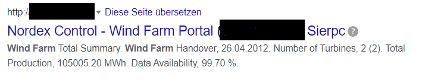
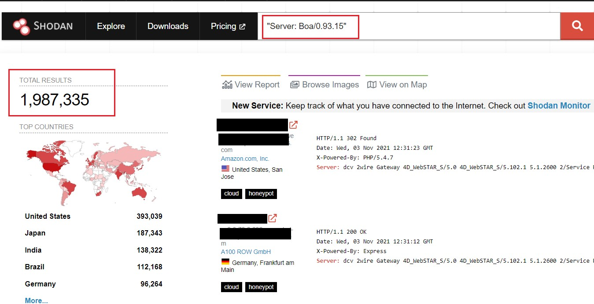

# Shodan.io

Shodan ist eine Suchmaschine, die nach verschiedenen Objekten sucht, die mit dem Internet verbunden sind. Diese Objekte können Webcams, Router oder wirklich alles sein, was mit dem Internet verbunden ist. IoT-Systeme gehören aufgrund mangelnder Sicherheit zu den am einfachsten und häufigtsen zu findenden. Shodan sucht nach Service-Bannern und verwendet eine Methode namens Banner-Grabbing.
Banner Grabbing besteht darin, sich mit einer App zu verbinden und zu sehen, was der Output dieser App ist. Im Grunde genommen sammelt Shodan alle möglichen Informationen aus diesem Output und klassifiziert sie, nach der Art von Informationen, die es erhalten hat. Diese Informationen können beispielsweise vom Typ IP-Adressen, Portnummer oder Art des Betriebssystems der Anwendung sein.  
Shodan prüft auch, welche Ports geschlossen und welche geöffnet sind. Diese Informationen befinden sich in den Bannern der einzelnen "Dienste". Ein Banner besteht aus den Informationen eines "Dienstes". Jeder „Dienst“ hat ein anderes Banner, zum Beispiel hat FTP einen „Willkommensstring“ und unterschiedliche Ergebnisse. Shodan verwendet zum Beispiel das VNC-Banner, das anzeigt, ob der Dienst über eine Authentifizierung verfügt oder nicht. Aufgrund der Anzahl der vorhandenen Banner ist es manchmal sehr schwierig zu wissen, welche Informationen man erhält. Zum Beispiel in HTTP Telnet ist es einfach, da die Banner von Anfang an eindeutige Informationen liefern, die helfen, abzuleiten, welcher Gerätetyp verwendet wird. Bei anderen Arten von "Diensten" wird dies jedoch kompliziert, z. B. ist es etwas komplizierter, abzuleiten, welche Art von System ein FTP verwendet. Auf die gleiche Weise kann Shodan die notwendigen Informationen auf folgende Weise erhalten: Es wird eine Reihe von HILFE-Anfragen gesendet, die das System akzeptiert und so kann Shodan weitere Informationen erhalten.
Shodan kann auf verschiedene Weisen verwendet werden. Am einfachsten ist es, zum Explore in der Hauptseite zu gehen und nach dem Systemtyp zu suchen, den man sucht oder finden möchte. Dafür muss man nicht viel Wissen haben und es ist sehr einfach etwas zu finden. Die andere Möglichkeit ist die direkte Suche nach Tags, die die Suche genauer machen. Sie können alle Arten von Geräten durchsuchen, während sie mit dem Internet verbunden sind. Zum Beispiel, wenn man nach "webcamxp country:AT" sucht. bekommt man die folgenden Ergebnisse:  
webcamXP 5  
o	XX.XXX.XXX.XX  
o	XX-XXX-XXX-XX.cni.at  
o	Stadtgemeinde/Stadtwerke Imst  
o	 Austria, Imst  
o	  
HTTP/1.1 200 OK  
Connection: close  
Content-Type: text/html; charset=utf-8  
Content-Length: 7301  
Cache-control: no-cache, must revalidate  
Date: Fri, 03 Jun 2022 02:58:44 GMT  
Expires: Fri, 03 Jun 2022 02:58:44 GMT  
Pragma: no-cache  
Server: webcamXP 5  

Dieses Ergebnis wurde gefunden, indem nach dem Server und dem Land als Tags direkt in Shodan gesucht wurde. Auf diese Weise kann man lernen, welche Systeme verbunden sind und welche nicht. Mit dieser Information ist einfacher zu wissen, welche anderen Daten man erhalten kann. Eines der beliebtesten Beispiele sind die Wind Farms, diese können durch Suchen im Explore gefunden werden. Man kann die Webcams sehen und wie viele in Betrieb sind. Dann kann man die IP-Adresse verwenden, um die Seite bei Google zu finden.  

Shodan wird von Experten, Experten für Cybersicherheit, Forschern oder Strafverfolgungsbehörden in der Cybersicherheit eingesetzt. Banner Grabbing ist im Bereich Pentesting sehr wichtig. Was Shodan tut, ist dem, was ein Hacker tut, sehr ähnlich. Es ist nur so, dass Hacker anonymer sein wollen. Sie können andere Tools wie Botnets und TOR verwenden. Das TOR-Netzwerk „The onion Router“ ermöglicht es den Benutzern, anonym zu kommunizieren. Bei Tools, die mehr Informationen liefern, beispielsweise beim Port-Scanning, wird automatisch ein Banner-Grabbing durchgeführt.

Ein Aufsehen erregendes Beispiel ist, wie AT&T mithilfe von Shodan Malware fand, die Millionen von Routern angreift.
Die Malware wurde in der Programmiersprache Golang geschrieben, die anscheinend sehr beliebt ist, um Viren zu infizieren. Antivirenprogramme haben eine sehr geringe Effizienz bei der Erkennung von Viren die mit Golang geschrieben wurden.
Malware „BotangaGo“ gibt zunächst Auskunft darüber, wie viele Ordner sie infiziert hat, dann beginnt sie damit, Skripte in Dateien zu speichern und im letzten Schritt ruft die Malware eine Funktion namens „scannerInitExploits“ auf, die den Angriff startet.
Von hier aus führt die Malware eine Zuordnung der anfälligen Systeme durch und eine „GET“-Anfrage wird gesendet, dann wird der String „Server: Boa/0.93.15“ der Funktion „main_infectFunctionGponFiber“ zugeordnet. Dies ist sehr gefährlich, da es dem Angreifer Zugriff auf direkte Befehle an das Betriebssystem verschafft.
Dies ist nur ein Beispiel für eine Angriffsfunktion dieser Malware. Von hier aus wusste AT&T, welche Server sie suchen musste, dann könnte AT&T Shodan nach dem folgenden Server durchsuchen: Boa/0.93.15, was das folgende Ergebnis lieferte.

Diese Ergebnisse geben die Geräte an, die von dieser Funktion angegriffen werden könnten. Wie man sehen kann, gibt es viele. Diese Ergebnisse zeigen nur, wie groß das Problem ist, die Risiken und wie verletzlich es ist, aber es gibt keine Gegenmaßnahmen. Sie geben Empfehlungen dazu, was getan werden kann, aber sie sind allgemeiner, wie z. B. aktualisierte Software, keine Verwendung des Internets unter Linux oder IoT und wenn es verwendet wird, Verwendung einer Firewall, und es ist sehr wichtig, ein gutes Antivirenprogramm zu haben.

## Literatur & Quellen

[1]Hacking Exposed: Network Security Secrets and Solutions,Third Edition September 2001
Go to Hacking Exposed  
Authors:Stuart McClure,Joel Scambray,George Kurtz  
Publisher: McGraw-Hill Professional  

[2]https://shodan.io  
[3]https://blog.shodan.io/what-is-a-banner/  
[4]https://cybersecurity.att.com/blogs/labs-research/ att-alien-labs-finds-new-golang-malwarebotenago-targeting-millions-of-routers-and-iot-devices-with-more-than-30-exploits  

