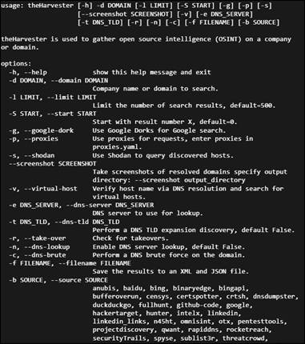
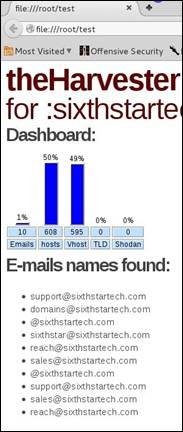
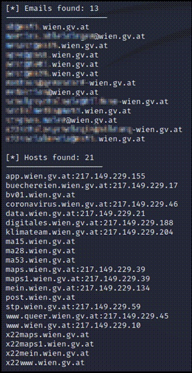

## TheHarvester
Bei „theHarvester“ handelt es sich um ein Opensource-Tool welches in Python entwickelt wurde. Es ist ein Standardtool von Kali Linux welches frei zugängliche Informationen zum angegeben Suchbegriff bzw. einer Webseite sammelt und bei Bedarf speichern kann. 
Außerhalb von Kali Linux besteht ebenfalls die Möglichkeit für weitere Betriebssysteme einen separaten Download mit anschließender Installation durchzuführen. Python muss hierfür separat heruntergeladen werden.

Unter freien Informationen können Subdomains, IP-Adressen, offene Ports, Namen, Emailadressen etc. gesammelt werden. Ein mögliches Ergebnis können nicht offiziell bekannte Subdomains sein welche jedoch in Suchmaschinen indiziert sind. Mit theHarvester ist es möglich ein Profil des Angriffsziels zu eine gezielte Angriffsstrategie zurechtlegen zu können und den Einsatz weiterer Tools und Maßnahmen aufzubereiten. 

Das Tool ermöglicht es die Ergebnisse der Suchanfragen in einem XML- oder JSON-File zu speichern. Beim Aufruf dieses Files werden die einzelnen Teilergebnisse sowie die Statistik der Suche numerisch als auch graphisch angezeigt. 

Bevor „theHarvester“ verwendet wird, sollte unterschieden werden welches Ziel verfolgt wird. Bei einem gezielten ausspähen einer Firmenwebseite auf Sicherheitslücken im Auftrag der Firma kann das Tool bedenkenlos genutzt werden. Sollte man nicht ermächtigt sein, kann es je nach den örtlichen Rechtsvorschriften zu strafrechtlichen Überschreitungen kommen. 
Da derartige Suchanfragen Spuren hinterlassen ist es sinnvoll sie über VPN-Tunnel und Netzwerke durchzuführen, da es sonst häufig zu einem Tracking bzw. je nach zu untersuchender Seite zu einem Hackback kommen kann. 

Unter der Verwendung von Google-Dorks (oftmals als Google-Hacking bezeichnet) können beispielsweise Schwachstellen wie Beispielsweise öffentlich zugängliche Logfiles, Admin-Passwörter oder ähnliches gefunden werden. Bei Eingabe dieser Passwörter mit den dazugehörigen Accounts  würde nach österreichischer Rechtslage eine Strafrechtliche Überschreitung stattfinden weshalb derartige vorhaben strickt zu unterlassen sind. Google-Dorks kommen durch nicht gewünschte Veröffentlichung von Files oder zu geringer Absicherung von Daten zum Vorschein.

Das nachfolgende Bild zeigt die Auflistung der Befehle welche in „theHarvester“ zur Verfügung stehen.

Einige Server verweigern automatisierte Anfragen so wie sie von theHarvester getätigt werden. Um diesen Schutz zu umgehen müssen die von der Seite gesetzten Cookies akzeptiert und aus dem Browser herauskopiert, und in die Anfrage integriert werden.

Eine weitere Möglichkeit diesen Schutz zu umgehen sind die Abfrageintervalle, welche gewählt werden können. 

Die gefundenen Emailadressen können als Grundlage für nachfolgende Open Source Intelligence (OSINT) Recherchen verwendet werden. Dabei ist es möglich die Mailadressen Personen zuordnen zu können, welche in weiterer Folge das Ziel von „Social Engineering“ sind. Es ist allerdings auch möglich an gewonnene Email-Adressen Beispielsweise Phising-Mails zu versenden. 
 
Bei der Abfrage von wien.gv.at konnte alleine mit Google als Quelle folgendes Ergebnis zustande gebracht werden. Trotz der öffentlichen Zugänglichkeit der Adressen wurden die Namen der E-Mailkonten unkenntlich gemacht.

# Quellen 
[1]https://www.kali.org/tools/theharvester/ - theharvester Usage Example [14.05.2022].  
[2]https://www.hacking-tutorial.com/tips-and-trick/information-gathering-using-theharvester-in-kali-linux/ - Information Gathering Using TheHarvester In Kali Linux [26.05.2022].  
[3]https://www.youtube.com/watch?v=4NFT_cjTun4 Kali Linux - The Harvester Process and Functions🔥EP:27 [26.05.2022].  

