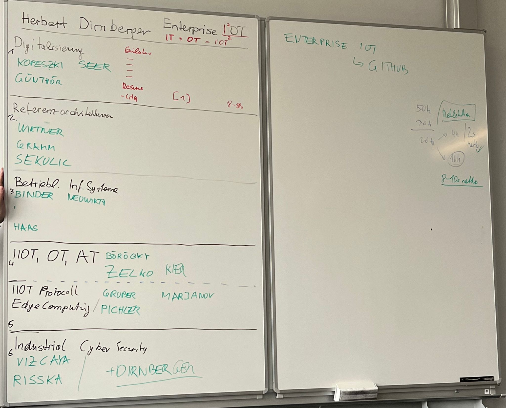

## Themen-/Gruppenzuweisung  
  

## Gruppenarbeit  
+ Studenten in sechs Themengruppen (3er-Teams)  
+ 8 Seiten (für 3er-Teams, sonst Abstimmung)  
+ Abgabe im Gitlab-Repo  
https://git.nwt.fhstp.ac.at/lbdirnberger/enterprise-iot
+ Soll eine Zusammenfassung des ganzen Themengebiet sein  

## Einzelarbeit  
+ 2 Seiten  
+ Abgabe im Gitlab-Repo  
https://git.nwt.fhstp.ac.at/lbdirnberger/enterprise-iot/-/tree/master/Einzelarbeiten
+ Themen schon bekannt  
+ Soll zur Lehrveranstalung passen und wenn geht zur Gruppenarbeit, sonst Abstimmung notwendig  

## Abgabetermin  
+ 06.06.2022 23:59  
+ Benachrichtigung am eCampus, wenn erledigt
+ Inkl 5-10 Zeilen Feedback zum Unterricht
